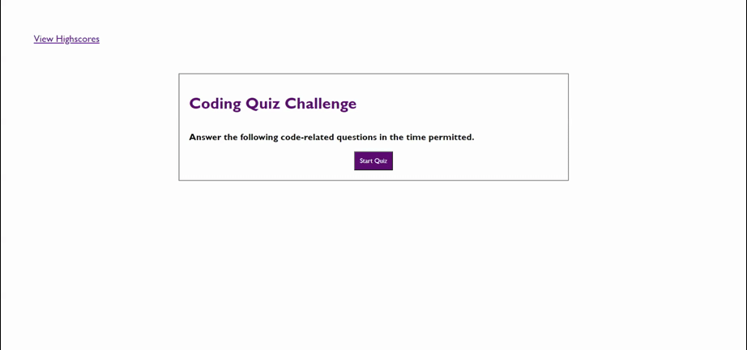

# coding-quiz

## Description
 
This application generates quiz questions while a timer is running in order to test knowledge. 
Scores can be saved in order to track progress.

## Installation

Follow the link to the webpage:
https://kimberlyseddon.github.io/coding-quiz/

To start quiz and timer function press the start button. Answer questions in the alloted time and save your scores after. 

## Usage
Use this application to review your coding knowledge! Save high scores to compare with friends or yourself!

## Credits